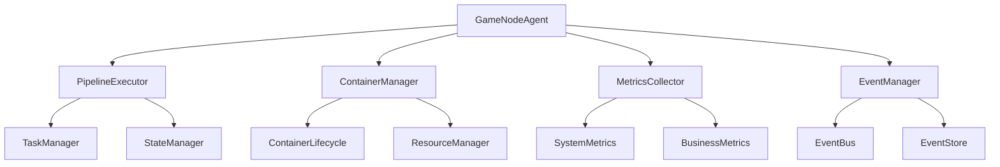

# GameNodeAgent 设计文档

## 1. 系统概述

### 1.1 设计目标

GameNodeAgent 是游戏节点系统的核心组件，负责在物理节点上执行具体的任务和资源管理。主要目标包括：

1. **任务执行**

   - 执行 Pipeline 任务
   - 管理容器生命周期
   - 处理任务状态同步

2. **资源管理**

   - 监控系统资源
   - 管理容器资源
   - 优化资源使用

3. **状态同步**

   - 心跳检测
   - 状态报告
   - 指标收集

### 1.2 核心职责

1. **Pipeline 执行**

   - 接收和执行 Pipeline 任务
   - 管理任务生命周期
   - 处理任务状态变更

2. **容器管理**

   - 创建和管理容器
   - 监控容器状态
   - 处理容器资源

3. **资源监控**

   - 收集系统指标
   - 监控资源使用
   - 报告异常情况

4. **状态同步**

   - 维护心跳连接
   - 同步节点状态
   - 处理断线重连

## 2. 系统架构

### 2.1 启动命令

#### 2.1.1 命令行启动

```bash
# 基本用法
beagle-wind-agent --node-id <id> --server-addr <addr>

# 显示版本信息
beagle-wind-agent --version

# 显示帮助信息
beagle-wind-agent --help
```

命令行参数说明：

- `--node-id`: 节点唯一标识符（必需）
- `--server-addr`: gRPC 服务器地址（必需）
- `--version`: 显示版本信息
- `--help`: 显示帮助信息

#### 2.1.2 程序启动

```go
func NewGameNodeAgent(
    id string,                    // 节点唯一标识
    serverAddr string,            // 服务器地址
    eventManager event.EventManager,  // 事件管理器
    logManager log.LogManager,        // 日志管理器
    dockerClient *dockerclient.Client, // Docker客户端
    config *AgentConfig,             // 代理配置
) *GameNodeAgent
```

#### 2.1.3 参数说明

1. **必需参数**

   - `id`: 节点的唯一标识符，用于在系统中唯一识别一个节点
   - `serverAddr`: gRPC 服务器地址，用于建立与服务器的连接

2. **服务依赖**

   - `eventManager`: 事件管理系统
   - `logManager`: 日志管理系统
   - `dockerClient`: Docker 容器管理客户端

3. **配置信息**

   ```go
   type AgentConfig struct {
       HeartbeatPeriod time.Duration  // 心跳间隔
       RetryCount      int            // 重试次数
       RetryDelay      time.Duration  // 重试延迟
       MetricsInterval time.Duration  // 指标采集间隔
   }

   // NewDefaultAgentConfig 创建新的代理配置
   func NewDefaultAgentConfig() *AgentConfig {
       return &AgentConfig{
           HeartbeatPeriod: 30 * time.Second,  // 30秒心跳
           RetryCount:      3,                 // 3次重试
           RetryDelay:      5 * time.Second,   // 5秒延迟
           MetricsInterval: 15 * time.Second,  // 15秒采集
       }
   }
   ```

#### 2.1.4 启动流程

1. **参数解析**

   ```go
   // 解析命令行参数
   nodeID := flag.String("node-id", "", "节点ID")
   serverAddr := flag.String("server-addr", "", "服务器地址")
   showVersion := flag.Bool("version", false, "显示版本信息")
   flag.Parse()
   ```

2. **环境检查**

   - 验证必要参数
   - 检查 Docker 环境
   - 初始化日志系统

3. **组件初始化**

   - 创建事件管理器
   - 创建日志管理器
   - 创建 Docker 客户端
   - 创建代理配置

4. **启动服务**
   - 创建上下文
   - 启动 Agent
   - 处理信号
   - 优雅关闭

#### 2.1.5 配置说明

1. **默认配置**

   - 心跳间隔：30 秒
   - 重试次数：3 次
   - 重试延迟：5 秒
   - 指标采集间隔：15 秒

2. **配置调整**

   ```go
   // 示例：自定义配置
   config := NewDefaultAgentConfig()
   config.HeartbeatPeriod = 60 * time.Second  // 修改心跳间隔
   config.RetryCount = 5                      // 修改重试次数
   ```

#### 2.1.6 动态信息

以下信息将在节点注册时通过资源信息上报：

1. **节点信息**

   - 节点别名（alias）
   - 节点型号（model）
   - 节点区域（region）

2. **硬件信息**
   - CPU 信息
   - 内存信息
   - GPU 信息
   - 磁盘信息
   - 网络信息

### 2.2 组件结构



### 2.3 核心组件

1. **PipelineExecutor**

   - 任务执行器
   - 状态管理器
   - 事件通知器

2. **ContainerManager**

   - 容器生命周期管理
   - 资源分配和回收
   - 容器状态监控

3. **MetricsCollector**

   - 系统指标收集
   - 业务指标收集
   - 数据上报管理

4. **EventManager**

   - 事件总线
   - 事件存储
   - 事件分发

## 3. 通信机制

### 3.1 gRPC 服务

1. **节点管理**

   ```protobuf
   service GameNodeAgentService {
     rpc Register(RegisterRequest) returns (RegisterResponse);
     rpc Heartbeat(HeartbeatRequest) returns (HeartbeatResponse);
     rpc UpdateStatus(UpdateStatusRequest) returns (UpdateStatusResponse);
   }
   ```

2. **Pipeline 管理**

   ```protobuf
   service PipelineAgentService {
     rpc ExecutePipeline(ExecutePipelineRequest) returns (ExecutePipelineResponse);
     rpc UpdatePipelineStatus(UpdatePipelineStatusRequest) returns (UpdatePipelineStatusResponse);
     rpc CancelPipeline(CancelPipelineRequest) returns (CancelPipelineResponse);
   }
   ```

3. **日志流**

   ```protobuf
   service LogStreamService {
     rpc StreamLogs(StreamLogsRequest) returns (stream LogEntry);
   }
   ```

### 3.2 通信流程

1. **注册流程**

   - 节点启动时向服务器注册
   - 获取节点配置和认证信息
   - 建立心跳连接

2. **任务执行流程**

   - 接收任务请求
   - 执行任务步骤
   - 报告执行状态
   - 处理任务完成

3. **状态同步流程**

   - 定期发送心跳
   - 报告资源使用
   - 同步任务状态

## 4. 开发计划

### 4.1 第一阶段

1. **基础框架**

   - [x] 项目结构
   - [x] 核心组件
   - [x] 通信机制

2. **核心功能**

   - [x] Pipeline 执行
   - [x] 容器管理
   - [x] 状态同步

### 4.2 第二阶段

1. **功能完善**

   - [ ] 资源监控
   - [ ] 错误处理
   - [ ] 安全机制

2. **性能优化**

   - [ ] 资源管理
   - [ ] 通信优化
   - [ ] 部署优化

### 4.3 第三阶段

1. **运维支持**

   - [ ] 监控系统
   - [ ] 故障处理
   - [ ] 运维工具

2. **文档完善**

   - [ ] 开发文档
   - [ ] 部署文档
   - [ ] 运维手册

## 5. 代码修改建议

### 5.1 命令行参数修改

1. **参数变更**
   ```go
   // 修改前
   nodeID := flag.String("node-id", "", "节点ID")
   nodeName := flag.String("node-name", "", "节点名称")
   
   // 修改后
   nodeID := flag.String("node-id", "", "节点ID")
   serverAddr := flag.String("server-addr", "", "服务器地址")
   showVersion := flag.Bool("version", false, "显示版本信息")
   ```

2. **版本信息**
   ```go
   // 添加版本信息显示
   if *showVersion {
       fmt.Printf("Beagle Wind Game Agent v%s\n", version)
       fmt.Printf("Build Time: %s\n", buildTime)
       return
   }
   ```

### 5.2 配置初始化修改

1. **配置创建**
   ```go
   // 修改前
   config := &gamenode.AgentConfig{}
   
   // 修改后
   config := gamenode.NewDefaultAgentConfig()
   ```

### 5.3 启动流程优化

1. **环境检查**
   ```go
   // 添加环境检查
   if err := checkEnvironment(); err != nil {
       stdlog.Fatalf("环境检查失败: %v", err)
   }
   
   func checkEnvironment() error {
       // 检查 Docker 环境
       if _, err := client.NewClientWithOpts(client.FromEnv, client.WithAPIVersionNegotiation()); err != nil {
           return fmt.Errorf("Docker 环境检查失败: %v", err)
       }
       return nil
   }
   ```

2. **组件初始化顺序**
   ```go
   // 优化初始化顺序
   // 1. 创建事件管理器
   eventManager := event.NewDefaultEventManager()
   
   // 2. 创建日志管理器
   logManager := log.NewDefaultLogManager()
   
   // 3. 创建 Docker 客户端
   dockerClient, err := client.NewClientWithOpts(client.FromEnv, client.WithAPIVersionNegotiation())
   if err != nil {
       stdlog.Printf("警告: 无法创建 Docker 客户端: %v", err)
       dockerClient = nil
   }
   
   // 4. 创建代理配置
   config := gamenode.NewDefaultAgentConfig()
   ```

3. **优雅关闭实现**
   ```go
   // 添加优雅关闭
   sigCh := make(chan os.Signal, 1)
   signal.Notify(sigCh, syscall.SIGINT, syscall.SIGTERM)
   
   select {
   case err := <-errCh:
       stdlog.Printf("Agent 错误: %v", err)
   case sig := <-sigCh:
       stdlog.Printf("收到信号: %v", sig)
   }
   
   // 执行清理
   cancel()
   agent.Stop()
   ```

### 5.4 完整代码示例

```go
func main() {
    // 解析命令行参数
    nodeID := flag.String("node-id", "", "节点ID")
    serverAddr := flag.String("server-addr", "", "服务器地址")
    showVersion := flag.Bool("version", false, "显示版本信息")
    flag.Parse()
    
    // 显示版本信息
    if *showVersion {
        fmt.Printf("Beagle Wind Game Agent v%s\n", version)
        fmt.Printf("Build Time: %s\n", buildTime)
        return
    }
    
    // 验证必要参数
    if *nodeID == "" {
        stdlog.Fatal("必须指定节点ID (--node-id)")
    }
    if *serverAddr == "" {
        stdlog.Fatal("必须指定服务器地址 (--server-addr)")
    }
    
    // 环境检查
    if err := checkEnvironment(); err != nil {
        stdlog.Fatalf("环境检查失败: %v", err)
    }
    
    // 组件初始化
    eventManager := event.NewDefaultEventManager()
    logManager := log.NewDefaultLogManager()
    dockerClient, err := client.NewClientWithOpts(client.FromEnv, client.WithAPIVersionNegotiation())
    if err != nil {
        stdlog.Printf("警告: 无法创建 Docker 客户端: %v", err)
        dockerClient = nil
    }
    config := gamenode.NewDefaultAgentConfig()
    
    // 创建 Agent
    agent := gamenode.NewGameNodeAgent(
        *nodeID,
        *serverAddr,
        eventManager,
        logManager,
        dockerClient,
        config,
    )
    
    // 创建上下文
    ctx, cancel := context.WithCancel(context.Background())
    defer cancel()
    
    // 创建错误通道
    errCh := make(chan error, 1)
    
    // 启动 Agent
    go func() {
        if err := agent.Start(ctx); err != nil {
            errCh <- fmt.Errorf("启动 Agent 失败: %v", err)
        }
    }()
    
    // 等待信号
    sigCh := make(chan os.Signal, 1)
    signal.Notify(sigCh, syscall.SIGINT, syscall.SIGTERM)
    
    // 处理信号或错误
    select {
    case err := <-errCh:
        stdlog.Printf("Agent 错误: %v", err)
    case sig := <-sigCh:
        stdlog.Printf("收到信号: %v", sig)
    }
    
    // 执行清理
    cancel()
    agent.Stop()
}
```
