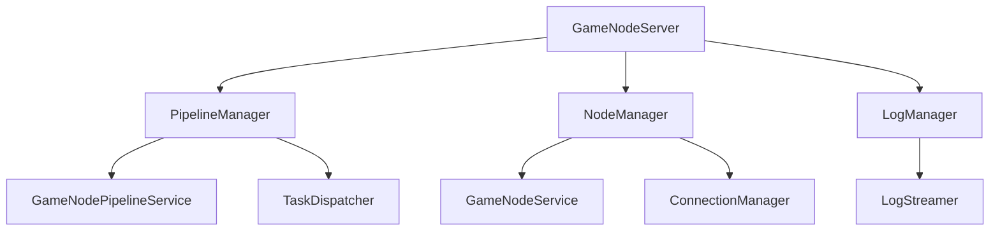

# GameNodeServer 设计文档

## 1. 系统概述

GameNodeServer 是 GameNode 系统的核心服务组件之一，负责管理游戏节点的 Pipeline 任务。它是 GameNodeCommunication 的重要组成部分，通过 gRPC 与 GameNodeAgent 进行通信。

### 1.1 设计原则

1.1.1 **状态管理原则**

- 状态数据分为两类：
  - GameNode 状态数据：由 GameNodeService 统一管理
  - GameNodePipeline 状态数据：由 GameNodePipelineService 统一管理
- GameNodeServer 不存储任何状态数据
- 所有状态更新通过对应的 Service 进行
- 保持状态管理的一致性和集中性

1.1.2 **职责定位**

- GameNodeServer：纯通信服务组件

  - 负责与 Agent 的 gRPC 通信
  - 处理通信协议转换
  - 通过 GameNodeService 处理节点状态
  - 通过 GameNodePipelineService 处理 Pipeline 状态
  - 不存储任何状态数据

- GameNodeService：节点状态管理组件

  - 负责 GameNode 状态数据的存储
  - 处理节点状态更新逻辑
  - 维护节点数据一致性
  - 提供节点状态查询接口

- GameNodePipelineService：Pipeline 状态管理组件

  - 负责 Pipeline 状态数据的存储
  - 处理 Pipeline 状态更新逻辑
  - 维护 Pipeline 数据一致性
  - 提供 Pipeline 状态查询接口

### 1.2 核心职责

1.2.1 **节点连接管理**

- 处理节点注册请求
- 维护节点心跳
- 管理节点会话
- 采集节点资源信息

节点心跳与节点会话相关的数据属性，设计时应考虑存储在 GameNode.GameNodeStatus 类型中；
应首先考虑现有的 GameNode.GameNodeStatus 的属性是否满足需求，如不满足可以调整或新增；

GameNodeServer 不应该考虑存储 GameNode 的集合来处理这些数据；
以处理节点注册请求为例，GameNodeServer 初始化时，应该考虑传入 GameNodeService 作为 service 变量，然后调用 service 的相关方法完成节点注册的数据处理。
同样维护节点心跳与节点会话，涉及数据查询或者数据更新时，应考虑交给 service 变量去处理；
GameNodeServer 为以上需求设计任何类型结构来存储数据都是不合理的。

1.2.2 **节点监控**

- 采集节点 Metrics 数据
  - 系统指标：
    - CPU：使用率、核心数、频率、温度
    - 内存：使用率、总量、可用量、交换区使用
    - 磁盘：使用率、IOPS、读写速度、剩余空间
    - 网络：带宽使用、连接数、丢包率、延迟
  - 业务指标：
    - GPU：使用率、温度、功耗
    - 显存：总量、已用、剩余、使用率
  - 自定义指标：暂无
- 资源信息采集
  - 硬件资源：
    - CPU：型号、核心数、线程数、频率、缓存
    - 内存：总量、类型、频率、通道数
    - GPU：型号、显存大小、CUDA 核心数
    - 硬盘：型号、容量、类型、接口
  - 软件资源：
    - 操作系统：发行版、版本号、架构
    - 内核版本：主版本、次版本、修订号
    - 显卡驱动：驱动版本、CUDA 版本
    - 运行时环境：Docker 版本、Containerd 版本、Runc 版本
- 定时上报机制
  - Agent 定时采集（默认 15s）
  - 批量上报（默认 1min）
  - 异常阈值触发
- 资源信息更新时机
  - 节点注册时
  - 心跳包中携带
  - 资源变更时主动上报

1.2.3 **Pipeline 任务管理**

- 创建和分发 Pipeline 任务
- 跟踪任务执行状态
- 处理任务取消请求
- 管理 Step 状态变更

同样对于 pipeline 任务，其状态由 GameNodePipelineService 负责维护，GameNodeServer 初始化时应传入 GameNodePipelineService 实例，用于管理 pipeline 数据。
注意任何不满足业务需求的数据结构都应该提出修改意见，并修改 GameNodePipeline 对象，这个对象的位置有设计文件专门管；

1.2.4 **状态同步**

- 流式获取 Pipeline.Step 的执行日志

一般来讲，Pipeline 会在 Step 执行完毕后，由 Agent 收集 Step 执行的日志，推送给 Server，但是想要实时查阅 Pipeline 的 Step 执行日志，则需要采用"流式获取 Pipeline.Step 的执行日志"方法。

### 1.3 系统架构



## 2. 核心组件

### 2.1 PipelineManager

负责 Pipeline 任务的管理和执行：

```go
type PipelineManager struct {
    pipelineService *GameNodePipelineService
    taskDispatcher  *TaskDispatcher
}

// 任务分发器
type TaskDispatcher struct {
    agentConnections map[string]*AgentConnection
    mu              sync.RWMutex
}

// Agent连接
type AgentConnection struct {
    client  proto.GameNodeServiceClient
    conn    *grpc.ClientConn
    nodeID  string
}
```

#### 2.1.1 主要功能

1. **任务创建**

   - 验证任务参数
   - 通过 pipelineService 创建任务记录
   - 分配执行节点

2. **任务分发**

   - 选择目标节点
   - 序列化任务数据
   - 发送执行请求

3. **状态跟踪**

   - 接收状态更新
   - 通过 pipelineService 更新任务状态
   - 触发相关事件

### 2.2 NodeManager

负责节点连接管理：

```go
type NodeManager struct {
    nodeService    *GameNodeService
    connectionManager *ConnectionManager
}

// 连接管理器
type ConnectionManager struct {
    connections map[string]*AgentConnection
    mu          sync.RWMutex
}

// Agent连接
type AgentConnection struct {
    client  proto.GameNodeServiceClient
    conn    *grpc.ClientConn
    nodeID  string
}
```

#### 2.2.1 主要功能

1. **节点注册**

   - 验证节点信息
   - 通过 nodeService 处理注册数据
   - 创建 gRPC 连接

2. **心跳管理**

   - 接收心跳请求
   - 通过 nodeService 更新节点状态
   - 维护连接状态

3. **连接管理**

   - 维护 gRPC 连接
   - 处理连接异常
   - 清理断开的连接

### 2.3 LogManager

负责日志流管理：

```go
type LogManager struct {
    logStreamer *LogStreamer
}

// 日志流管理器
type LogStreamer struct {
    streams map[string]*LogStream
    mu      sync.RWMutex
}

// 日志流
type LogStream struct {
    pipelineID string
    stepID     string
    stream     proto.GameNodeService_StreamStepLogsClient
    status     StreamStatus
}
```

#### 2.3.1 主要功能

1. **日志流管理**

   - 创建日志流
   - 维护流状态
   - 处理流异常

2. **日志接收**

   - 接收实时日志
   - 处理日志格式
   - 转发日志数据

## 3. 接口设计

### 3.1 Proto 文件设计原则

3.1.1 **设计原则**

- 消息类型定义

  - 每个消息类型必须有明确的用途
  - 字段命名必须清晰且符合命名规范
  - 字段类型必须合适且符合最佳实践
  - 必须包含必要的元数据字段（如时间戳）

- 服务接口定义

  - 接口方法必须有明确的职责
  - 参数和返回值必须合理且完整
  - 必须考虑接口的扩展性
  - 必须考虑接口的兼容性

- 枚举类型定义

  - 枚举值必须有明确的含义
  - 枚举值必须保持向后兼容
  - 必须考虑枚举值的扩展性

  3.1.2 **变更流程**

- 变更申请

  - 提交变更申请，说明变更原因
  - 提供变更的详细设计
  - 评估变更的影响范围

- 变更评审

  - 评审变更的合理性
  - 评审变更的兼容性
  - 评审变更的实现方案

- 变更实施

  - 按照设计进行变更
  - 确保变更不影响现有功能
  - 更新相关文档和测试

- 变更验证

  - 验证变更的正确性
  - 验证变更的兼容性
  - 验证变更的性能影响

  3.1.3 **事件消息设计**

```protobuf
// 事件
message Event {
  string type = 1;      // 事件类型
  string node_id = 2;   // 节点ID
  string entity_id = 3; // 实体ID（如容器ID、流水线ID等）
  string status = 4;    // 事件状态
  string message = 5;   // 事件消息
  google.protobuf.Timestamp timestamp = 6; // 时间戳
  map<string, string> data = 7; // 额外数据字段
}
```

事件消息设计考虑：

1. 类型字段：用于区分不同的事件类型
2. 节点 ID：标识事件发生的节点
3. 实体 ID：标识事件相关的实体
4. 状态字段：表示事件的状态
5. 消息字段：提供事件的描述信息
6. 时间戳：记录事件发生的时间
7. 数据字段：存储事件的额外信息

### 3.2 gRPC 服务接口

```protobuf
service GameNodeService {
  // 节点管理
  rpc Register(RegisterRequest) returns (RegisterResponse);
  rpc Heartbeat(HeartbeatRequest) returns (HeartbeatResponse);
  rpc ReportMetrics(MetricsReport) returns (ReportResponse);
  rpc UpdateResourceInfo(ResourceInfo) returns (UpdateResponse);

  // Pipeline管理
  rpc ExecutePipeline(ExecutePipelineRequest) returns (ExecutePipelineResponse);
  rpc UpdatePipelineStatus(PipelineStatusUpdate) returns (UpdateResponse);
  rpc UpdateStepStatus(StepStatusUpdate) returns (UpdateResponse);
  rpc CancelPipeline(PipelineCancelRequest) returns (CancelResponse);

  // 日志流
  rpc StreamLogs(LogRequest) returns (stream LogEntry);
}

// 节点指标报告
message MetricsReport {
  string node_id = 1;
  int64 timestamp = 2;
  repeated Metric metrics = 3;
}

message Metric {
  string name = 1;
  string type = 2;
  double value = 3;
  map<string, string> labels = 4;
}

// 资源信息更新
message ResourceInfo {
  string node_id = 1;
  int64 timestamp = 2;
  HardwareInfo hardware = 3;
  SoftwareInfo software = 4;
  NetworkInfo network = 5;
}

message HardwareInfo {
  CPUInfo cpu = 1;
  MemoryInfo memory = 2;
  GPUInfo gpu = 3;
  DiskInfo disk = 4;
}

// Step状态更新
message StepStatusUpdate {
  string pipeline_id = 1;
  string step_id = 2;
  StepStatus status = 3;
  int64 start_time = 4;
  int64 end_time = 5;
  string error_message = 6;
  bytes logs = 7;
}

enum StepStatus {
  PENDING = 0;
  RUNNING = 1;
  COMPLETED = 2;
  FAILED = 3;
  CANCELLED = 4;
}
```

### 3.3 内部接口

```go
// PipelineManager 接口
type PipelineManager interface {
    CreatePipeline(ctx context.Context, req *CreatePipelineRequest) (*Pipeline, error)
    ExecutePipeline(ctx context.Context, req *ExecutePipelineRequest) error
    UpdateStatus(ctx context.Context, req *UpdateStatusRequest) error
    UpdateStepStatus(ctx context.Context, req *StepStatusUpdate) error
    CancelPipeline(ctx context.Context, req *CancelPipelineRequest) error
}

// NodeManager 接口
type NodeManager interface {
    RegisterNode(ctx context.Context, req *RegisterRequest) error
    UpdateHeartbeat(ctx context.Context, req *HeartbeatRequest) error
    GetNodeStatus(ctx context.Context, nodeID string) (*NodeStatus, error)
    ReportMetrics(ctx context.Context, req *MetricsReport) error
    UpdateResourceInfo(ctx context.Context, req *ResourceInfo) error
}

// LogManager 接口
type LogManager interface {
    StreamLogs(ctx context.Context, req *StreamLogsRequest) (<-chan LogEntry, error)
}
```

## 4. 业务流程

### 4.1 Pipeline 执行流程

1. **任务创建**

   ```go
   func (pm *PipelineManager) CreatePipeline(ctx context.Context, req *CreatePipelineRequest) (*Pipeline, error) {
       // 1. 验证请求参数
       if err := pm.validateRequest(req); err != nil {
           return nil, err
       }

       // 2. 通过 pipelineService 创建任务记录
       pipeline, err := pm.pipelineService.CreatePipeline(ctx, req)
       if err != nil {
           return nil, err
       }

       return pipeline, nil
   }
   ```

2. **任务分发**

   ```go
   func (pm *PipelineManager) ExecutePipeline(ctx context.Context, req *ExecutePipelineRequest) error {
       // 1. 获取目标节点
       node, err := pm.nodeManager.GetNode(req.NodeID)
       if err != nil {
           return err
       }

       // 2. 序列化任务数据
       data, err := pm.serializePipeline(req.Pipeline)
       if err != nil {
           return err
       }

       // 3. 发送执行请求
       return pm.sendExecuteRequest(ctx, node, data)
   }
   ```

3. **状态更新**

   ```go
   func (pm *PipelineManager) UpdateStatus(ctx context.Context, req *UpdateStatusRequest) error {
       // 1. 通过 pipelineService 更新任务状态
       if err := pm.pipelineService.UpdateStatus(ctx, req); err != nil {
           return err
       }

       return nil
   }
   ```

### 4.2 节点管理流程

1. **节点注册**

   ```go
   func (nm *NodeManager) RegisterNode(ctx context.Context, req *RegisterRequest) error {
       // 1. 验证节点信息
       if err := nm.validateNodeInfo(req.NodeInfo); err != nil {
           return err
       }

       // 2. 通过 nodeService 处理注册数据
       return nm.nodeService.RegisterNode(ctx, req)
   }
   ```

2. **心跳处理**

   ```go
   func (nm *NodeManager) UpdateHeartbeat(ctx context.Context, req *HeartbeatRequest) error {
       // 1. 通过 nodeService 更新节点状态
       return nm.nodeService.UpdateHeartbeat(ctx, req)
   }
   ```

3. **指标上报**

   ```go
   func (nm *NodeManager) ReportMetrics(ctx context.Context, req *MetricsReport) error {
       // 1. 验证指标数据
       if err := nm.validateMetrics(req.Metrics); err != nil {
           return err
       }

       // 2. 通过 nodeService 更新指标数据
       return nm.nodeService.UpdateMetrics(ctx, req)
   }
   ```

4. **资源信息更新**

   ```go
   func (nm *NodeManager) UpdateResourceInfo(ctx context.Context, req *ResourceInfo) error {
       // 1. 验证资源信息
       if err := nm.validateResourceInfo(req); err != nil {
           return err
       }

       // 2. 通过 nodeService 更新资源信息
       return nm.nodeService.UpdateResourceInfo(ctx, req)
   }
   ```

### 4.3 Pipeline 任务管理流程

1. **Step 状态更新**

   ```go
   func (pm *PipelineManager) UpdateStepStatus(ctx context.Context, req *StepStatusUpdate) error {
       // 1. 验证状态更新请求
       if err := pm.validateStepStatus(req); err != nil {
           return err
       }

       // 2. 根据状态类型处理日志
       if req.Status == StepStatus_COMPLETED || req.Status == StepStatus_FAILED {
           // 完整日志，保存到存储
           if err := pm.pipelineService.SaveStepLogs(ctx, req); err != nil {
               return err
           }
       } else if req.Status == StepStatus_CANCELLED {
           // 取消状态，不保存日志
           req.Logs = nil
       }

       // 3. 通过 pipelineService 更新 Step 状态
       return pm.pipelineService.UpdateStepStatus(ctx, req)
   }
   ```

## 5. 错误处理

### 5.1 错误类型

```go
type ServerError struct {
    Code    ErrorCode
    Message string
    Cause   error
}

const (
    ErrInvalidRequest ErrorCode = iota
    ErrNodeNotFound
    ErrNodeOffline
    ErrPipelineNotFound
    ErrPipelineFailed
    ErrInternal
)
```

### 5.2 错误处理策略

1. **请求验证错误**

   - 返回详细的错误信息
   - 不进行重试

2. **节点错误**

   - 尝试重新连接
   - 更新节点状态
   - 通知相关组件

3. **Pipeline 错误**

   - 记录错误日志
   - 更新任务状态
   - 触发错误事件

4. **内部错误**

   - 记录详细日志
   - 尝试恢复状态
   - 通知管理员

## 6. 监控指标

### 6.1 系统指标

1. **节点指标**

   - 在线节点数
   - 节点心跳延迟
   - 节点状态分布

2. **任务指标**

   - 任务队列长度
   - 任务执行时间
   - 任务成功率

3. **资源指标**

   - CPU 使用率
   - 内存使用率
   - 网络流量

### 6.2 业务指标

1. **Pipeline 指标**

   - 创建数量
   - 执行数量
   - 完成数量
   - 失败数量

2. **事件指标**

   - 事件发布数
   - 事件订阅数
   - 事件处理延迟

3. **日志指标**

   - 日志收集量
   - 日志存储量
   - 日志查询延迟
